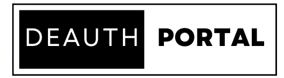

[![MIT License][license-shield]][license-url]
[![LinkedIn][linkedin-shield]][linkedin-url]

<!-- PROJECT LOGO -->
 

  

<!-- ABOUT THE PROJECT -->
## About The Project

NodeMCU ESP8266 microcontroller converted into a simple deauther and captive portal which can be act as evil twin attack. 

<!-- GETTING STARTED -->
## Getting Started

Steps to be followed are given to set and run locally.

### Requirements
1. python3
2. aircrack-ng
3. Handshake(Optional only if evil attack is used)

### Installation

1. First connect your own machine (which can later act as server too ) to the "RobinHood" SSID passwd "deauther"
2. Then run the python script given in your machine and make sure that your IP is 192.168.4.100
3. Before starting to deauthenticate you must have already captured the handshake file of the particular target and placed in the server as capfile.cap
4. After those steps setup the ssid name to the particular target name and start deauthenticating
5. Once a user enters your network he/she will be prompted with captive portal and when they entered the passwrd it will be cross checked with handshake you provided before
6. If it matches the user will be tricked to fake router upgrading page else shown a passwd error popup.
7. This is for educational purpose, Don't indulge in wrong activities.  

<!-- LICENSE -->
## License

Distributed under the MIT License. See `LICENSE` for more information.

<!-- CONTACT -->
## Contact

Ansari - [@twitter_handle](https://twitter.com/amsorry_offl) - ansari_official@yahoo.com

Project Link: [https://github.com/The-Robin-Hood/deauth_portal](https://github.com/The-Robin-Hood/deauth_portal)

(<a href="#top">back to top</a>)

<!-- MARKDOWN LINKS & IMAGES -->

[license-url]: https://github.com/The-Robin-Hood/deauth_portal/blob/master/LICENSE
[license-shield]: https://img.shields.io/github/license/The-Robin-Hood/dropit.svg
[linkedin-shield]: https://img.shields.io/badge/-LinkedIn-black.svg?logo=linkedin&colorB=555
[linkedin-url]: https://linkedin.com/in/ansari-s
[product-screenshot]: images/lightmode.png
[product-dscreenshot]: images/darkmode.png